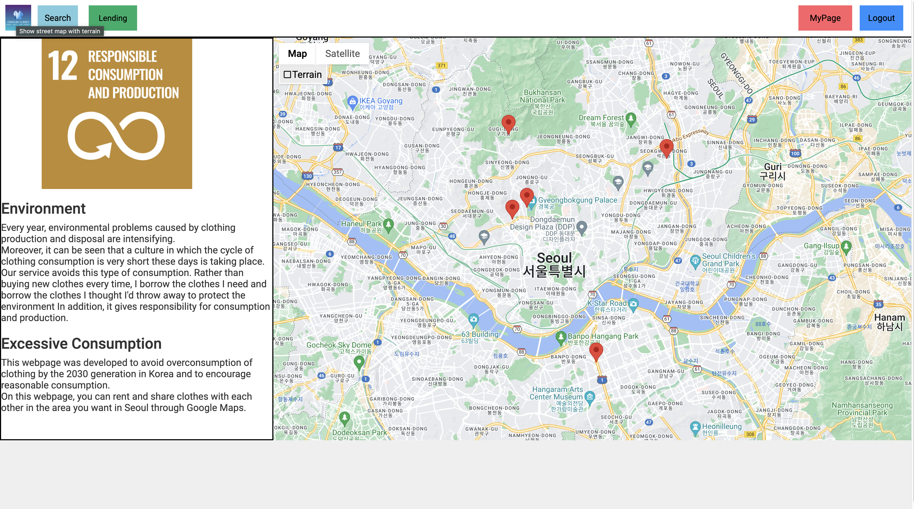
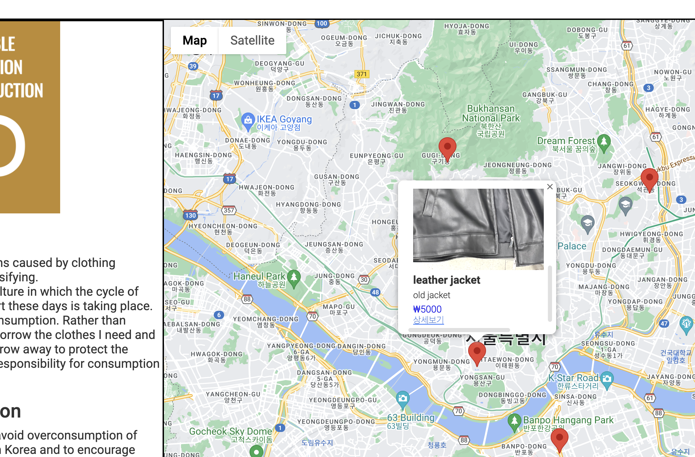
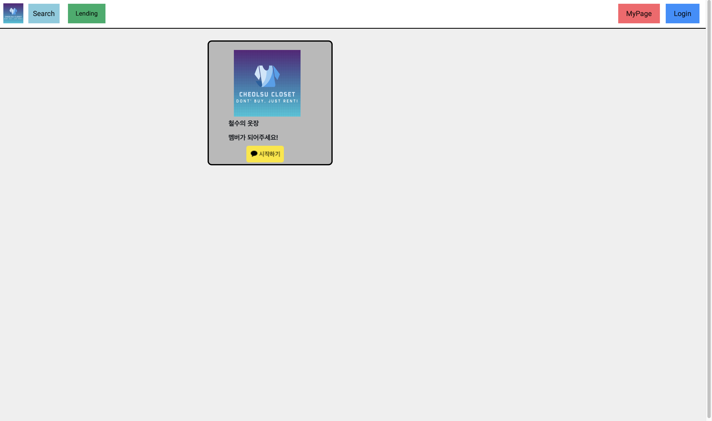
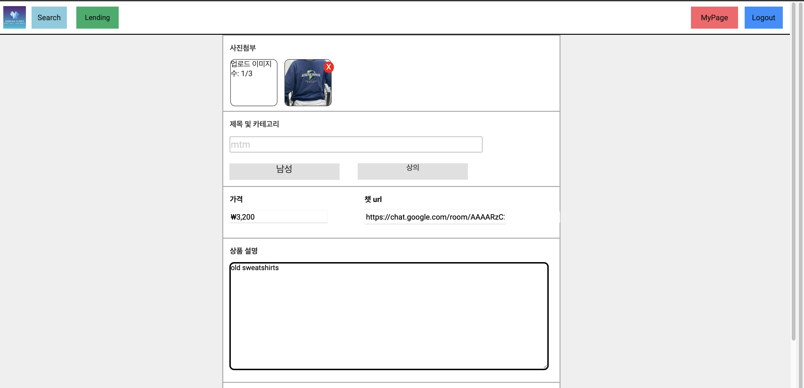
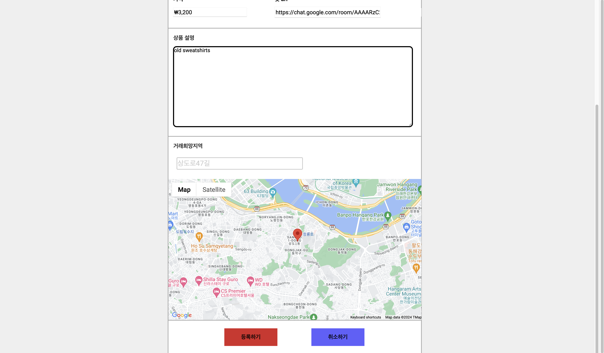
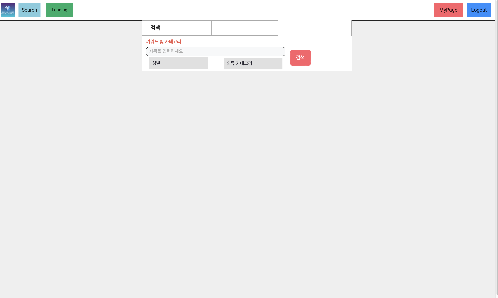
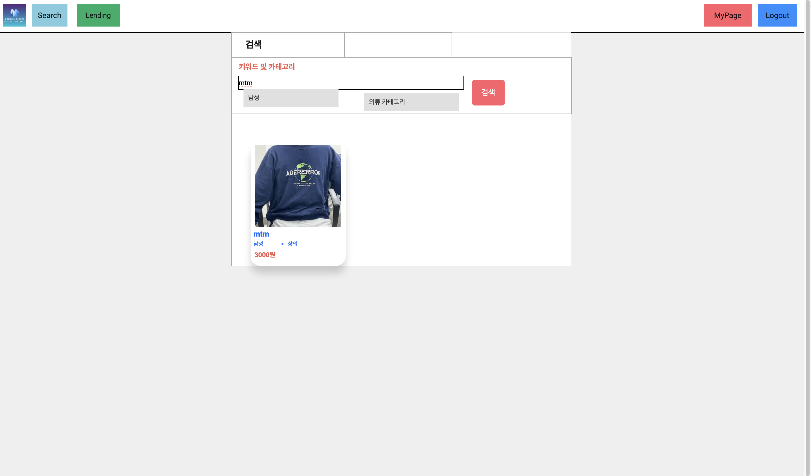
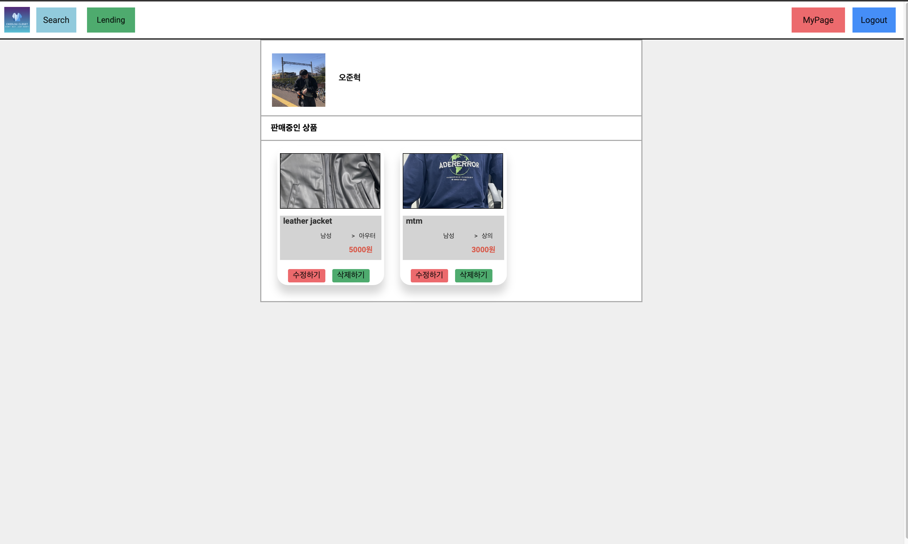

# 철수 옷장
###
---

1. Introduction

2. Excution Method

3. How to use

4. Project Architecture

 

# UN-SDGs

## environment
Every year, environmental problems caused by clothing production and disposal are intensifying.
Moreover, it can be seen that a culture in which the cycle of clothing consumption is very short these days is taking place.
Our service avoids this type of consumption.
Rather than buying new clothes every time, I borrow the clothes I need and borrow the clothes I thought I'd throw away to protect the environment
In addition, it gives responsibility for consumption and production.
## Excessive Consumption
This webpage was developed to avoid overconsumption of clothing by the 2030 generation in Korea and to encourage reasonable consumption.
On this webpage, you can rent and share clothes with each other in the area you want in Seoul through Google Maps.

# Google Technology In This Project

This project used Google Chat for making connection between users

In this project, we used Google maps for accessibility between neighbors.

# Don't Buy, Just Rent!

The Cheolsu Closet Project avoids the production of clothing due to indiscriminate consumption and focuses on expanding local communication and solving environmental problems by using clothing rentals between neighbors.

1. Unresponsible consumption & production
2. Rentals are conducted to determine if it is necessary consumption
3. the outbreak of responsible consumption
4. a decrease in production resulting in reckless environmental pollution caused by a decrease in consumption

# 🖥️ Details of the our web

- Home screan

 &nbsp;&nbsp;&nbsp;

In the home screen, the products posted by users along with the intentions of our project are plotted on the map. You can also click to see more.

- Detail screen

Those who want to rent a product from the page where they entered the detailed view can get more information about the product and can directly trade the product by accessing the Google Chat link posted by the lender by entering the chat button.

- Login screen

If you are a person who wants to rent a product, you should log in through the Kakao Talk social login.

- lending screen

 &nbsp;&nbsp;&nbsp;>

When you press the Lending button on the Lending Home screen, you'll see a screen where you can register the product you want to trade with. You can enter the image, title, gender, clothing category, content, and more of the product here, and enter Google Chat url to chat with the person who wants to borrow the product later. You can also register your desired trading location by moving the marker on the map.

- Search screen

 &nbsp;&nbsp;&nbsp;>

Those who want to rent a product can also search for the product by clicking the Search button, as well as the map on the website, and specifying the title and clothing category.

- MyPage

 &nbsp;&nbsp;&nbsp;>

If you are logged in, you can access My Page. On My Page, you can see your KakaoTalk profile picture and name, and you can update or delete the products you posted.

#  Stack

- Java version
  - Java : `17`
  - Spring : `3.2.2`
- React : `18.2.0`
- MySQL : `8.3.0`

# 🧑‍🔧

- TaeDong Han : https://github.com/210-reverof
- JunHuck Oh : https://github.com/SS-hj/
- HyeongJin Boo : https://github.com/junjange
- Minsuk Kim : https://github.com/TaegyuHan
