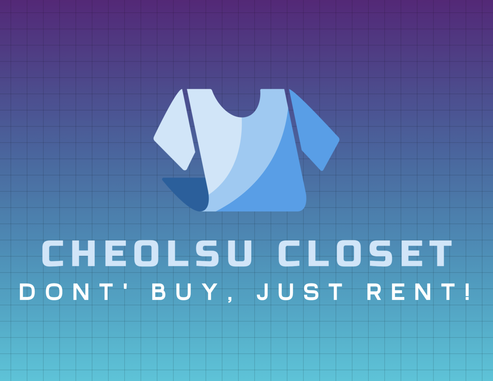
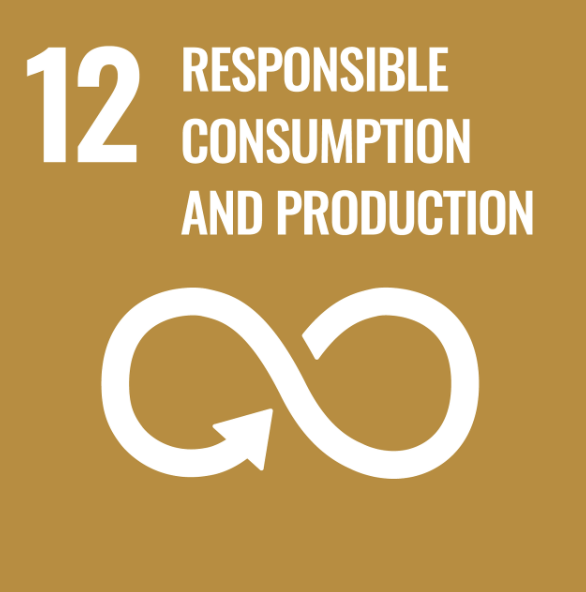

# 철수 옷장
###
---

1. Introduction

2. Excution Method

3. How to use

4. Project Architecture

 

# UN-SDGs

## environment
Every year, environmental problems caused by clothing production and disposal are intensifying.
Moreover, it can be seen that a culture in which the cycle of clothing consumption is very short these days is taking place.
Our service avoids this type of consumption.
Rather than buying new clothes every time, I borrow the clothes I need and borrow the clothes I thought I'd throw away to protect the environment
In addition, it gives responsibility for consumption and production.
## Excessive Consumption
This webpage was developed to avoid overconsumption of clothing by the 2030 generation in Korea and to encourage reasonable consumption.
On this webpage, you can rent and share clothes with each other in the area you want in Seoul through Google Maps.

# Google Technology In This Project

This project used Google Chat for making connection between users

In this project, we used Google maps for accessibility between neighbors.

# Don't Buy, Just Rent!

The Cheolsu Closet Project avoids the production of clothing due to indiscriminate consumption and focuses on expanding local communication and solving environmental problems by using clothing rentals between neighbors.

1. Unresponsible consumption & production
2. Rentals are conducted to determine if it is necessary consumption
3. the outbreak of responsible consumption
4. a decrease in production resulting in reckless environmental pollution caused by a decrease in consumption

# 🖥️ Details of the our web

- Home screan

 &nbsp;&nbsp;&nbsp; 

In the home screen, the products posted by users along with the intentions of our project are plotted on the map. You can also click to see more.

- write screen

On the map screen, you can get information about the location of reports. This screen displays report markers based on your signed-up location. But, you can also scroll, zoom in/out on the screen or just search the location to check markers based on other locations. If you click the floating button, your map screen is moved to your current location. You can see the title and explanation of the report by clicking the marker. If you tap the marker's information window, you can move to the report detail screen.

- Report writing screen

  
 
 
 
 
 
 
 
 
 
 
 
 
 
 
 
 
 

The report writing screen appears when you click the rainbow-colored middle button on the bottom navigation bar. You can put up to five pictures. You have to choose one category and write a title and explanation of your report. 

- Report list screen

 &nbsp;&nbsp;&nbsp;  &nbsp;&nbsp;&nbsp; 

Reports within your 10km radius are displayed in two tabs on the report list screen. The "reports" tab displays reports that haven't been solved yet. The "solved" tab displays solved reports. You can select categories that you want to display. To create a report, click the pencil icon. Also, you can search for a specific report by clicking the search icon.

- Report detail screen

 &nbsp;&nbsp;&nbsp;  &nbsp;&nbsp;&nbsp; 

The report detail screen provides a comment function. When you click the top right button, you can see the report’s exact location on the map page.

- My page screen

 &nbsp;&nbsp;&nbsp;  &nbsp;&nbsp;&nbsp; 

You can check personal information on my page screen. If you want to see the list of your reports, click the my report tab. If you want to change your information, click the settings tab.  You can change your nickname and update your location on this tab.

#  Stack

- Java version 
  - Java : `17`
  - Spring : `3.2.2`
- React : `18.2.0`
- MySQL : `8.3.0`

# 🧑‍🔧

- Won-young Lee : https://github.com/210-reverof
- Ha-jeong Lee : https://github.com/SS-hj/
- Jun-jang Jo : https://github.com/junjange
- Tae-gyu Han : https://github.com/TaegyuHan